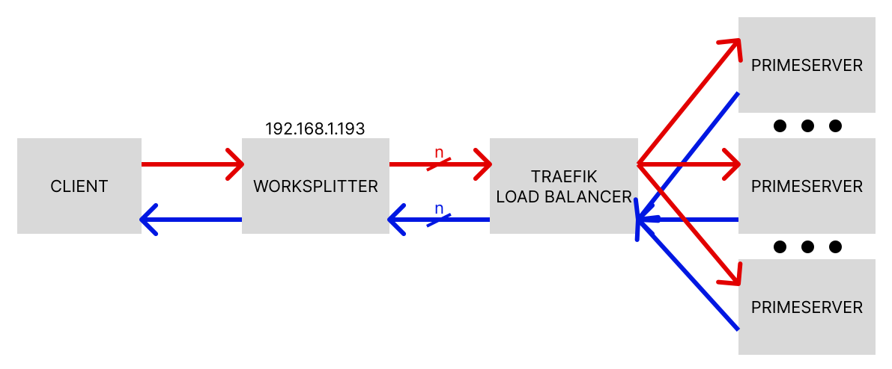

# DOCKER-PRIME_NUMBERS



> Rappresentazione grafica del sistema

### Descrizione

Il sistema e' suddiviso nelle seguenti componenti:
- **Client**: processo eseguito dall'utente, richiede di calcolare i numeri primi compresi tra un valore minimo e un valore massimo.

    La richiesta verra' effettuata a Worksplitter che restituira' il risultato.

- **Worksplitter**: 
    1. Riceve la richiesta dal client
    2. Suddivide il range di valori da calcolare in parti piu' piccole di uguali dimensioni
        > Piu' e' grande l'ordine di grandezza del numero di valori e piu' il range viene suddiviso in piu' parti
    3. Effettua ```n``` richieste verso traefik per calcolare i numeri primi compresi negli intervalli piu' piccoli appena calcolati
    4. Colleziona i risultati parziali ottenuti da traefik e li ricompone
    5. Restituisce il risultato complessivo al client

- **Traefik**: ricevute ```n``` richieste da worksplitter si occupa di fare il load balancing delle richieste verso i processi di calcolo (i primeserver)
    > Traefik, essendo ben integrato con tecnologie di containerizzazione come docker, riesce a bilanciare le richieste dinamicamente quando aumentano/diminuiscono i container primeserver in esecuzione

- **Primeserver**: ricevuta la richiesta con l'intervallo di numeri primi da calcolare li calcola e restituisce il risultato.

## Obiettivi del progetto

L'obiettivo principale del progetto e' studiare docker e approfondire, in particolare, gli aspetti di rete.

## Requisiti del progetto
- [X] dockerizzare il processo server
- [X] introdurre un load balancer tra client e server per astrarre la presenza di piu' server di calcolo
- [X] assegnare ai container indirizzi IP della rete fisica come se fossero macchine virtuali

## Eseguire il progetto

> NOTA: se si utilizza una interfaccia wireless su cui indirizzare il traffico della rete macvlan bisogna utilizzare una ipvlan invece della rete macvlan.
>
> Gli access point rifiutano i frame dagli indirizzi MAC che non sono stati autenticati con l'access point stesso.
>
> Per adattare il progetto per usare una rete ipvlan leggere il file ```appunti/ipvlan.md```.

1. Configurare il server DHCP per non distribuire indirizzi nel range che verra' assegnato da docker.
    > Se non vengono effettuate modifiche al file ```docker-compose.yml``` e ai comandi i container riceveranno indirizzi IP nel range ```192.168.1.128/25```

2. Se si esegue docker in una macchina virtuale occorre abilitare la modalita' promiscua attraverso le impostazioni del virtualizzatore.

    Per Virtualbox andare nelle impostazioni della macchina virtuale, sezione "Rete", modificare la scheda e scegliere "Scheda con bridge" e poi aprire il menu' cliccando "Avanzate" e selezionare l'opzione "Modalita' promiscua > Permetti tutto".

3. Se si desidera permettere la comunicazione tra l'host su cui viene eseguito docker e i container che girano su di esso e' necessario creare una interfaccia macvlan virtuale sull'host:

    ```
    sudo ip link add dockervlan-shim link enp0s3 type macvlan  mode bridge
    sudo ip addr add 192.168.1.129/32 dev dockervlan-shim
    sudo ip link set dockervlan-shim up
    # usa l'interfaccia creata per comunicare con la rete contenente i container
    sudo ip route add 192.168.1.128/25 dev dockervlan-shim
    ```
    > Modificare in modo opportuno l'interfaccia ```enp0s3``` con il nome dell'interfaccia fisica e i range IP in base agli indirizzi sulla rete fisica.
    >
    > Se si modificano gli indirizzi IP potrebbe essere necessario modificare anche il file ```docker-compose.yml```

4. Attivare la modalita' promiscua sull'host di docker per permettere ai container che hanno indirizzi MAC virtuali di ricevere e inviare pacchetti attraverso la stessa interfaccia fisica:

    ```
    sudo ip link set enp0s3 promisc on
    ```
    > Modificare in modo opportuno l'interfaccia ```enp0s3``` con il nome dell'interfaccia fisica

5. Creare il file di configurazione statica di traefik in:
    ```
    /etc/traefik/traefik.yml
    ```
    questo file deve contenere il contenuto del file presente in ```traefik/traefik.yml```

6. Eseguire mediante docker compose il progetto: docker compose scarichera' le immagini necessarie e fara' partire i container:

    ```
    sudo docker compose up
    ```
    > Aggiungere la flag ```-d``` se si vuole avviare i container in background

7. Eseguire il client nella cartella ```client``` su un dispositivo qualsiasi connesso alla rete specificando il parametro ```prime-number-interval``` seguito dal limite minimo e dal limite massimo dell'intervallo di numeri primi da calcolare.

    > NOTA: il client si aspetta che worksplitter, il punto di accesso del sistema di calcolo, sia raggiungibile all'indirizzo ```192.168.1.193```.
    >
    > Modificare l'indirizzo se necessario.

E' possibile aumentare il numero di repliche in esecuzione di primeserver con il comando:

```
sudo docker compose up --scale primeserver=5
```
> Sostituire ```5``` con il numero di repliche da eseguire. Aggiungere la flag ```-d``` se si vuole avviare i container in background.

## Annotazioni

> Altre annotazioni sono presenti nella cartella ```appunti```.

### Reti in docker

Un modo che hanno i container per comunicare con l'esterno e' attraverso la rete.

Docker mette a disposizione diversi tipi di reti (o "driver"):
- **bridge**: permette ad un gruppo di container che girano sullo stesso host e che sono connessi alla stessa rete bridge di comunicare fra di loro
- **host**: l'applicazione eseguita nel container si comporta, dal punto di vista della rete, come se fosse eseguita sull'host
- **overlay**: permette di far comunicare container distribuiti su piu' macchine fisiche su cui e' installato docker. (esempio: Docker Swarm)
- **macvlan**: assegnano indirizzi MAC ai container come se avessero delle interfacce fisiche di rete.

    Utilizza la modalita' promiscua per gestire il fatto che ad una singola interfaccia di rete fisica corrispondono piu' indirizzi MAC.

    La documentazione ufficiale di docker consiglia di utilizzare la rete bridge o overlay e di utilizzare questa opzione solo per applicazioni legacy o per applicazioni che si aspettano di avere una connessione fisica alla rete.
- **ipvlan**: simile a macvlan, ma invece di assegnare piu' indirizzi MAC virtuali ai container viene utilizzato un unico indirizzo MAC (dell'interfaccia fisica) in comune a tutti i container della rete.

    Esistono due modalita' di funzionamento:
    - l2: l'interfaccia fisica si comporta come uno switch.

        I messaggi di broadcast vengono inviati a tutte le sotto-interfacce virtuali dei container.

    - l3: l'interfaccia fisica si comporta come un router.

        Alle sotto-interfacce virtuali devono essere assegnate sottoreti diverse.

        I messaggi di broadcast vengono bloccati.
    
    E' consigliato usare le ipvlan al posto delle macvlan quando:
    - si usa una interfaccia fisica wireless (Wi-Fi).
        > Gli access point rifiutano i frame dagli indirizzi MAC che non sono stati autenticati con l'access point stesso.
    - l'interfaccia fisica ha raggiunto il limite massimo di indirizzi MAC virtuali supportati
    - il traffico macvlan viene bloccato dagli switch perche' sono impostati per non accettare indirizzi MAC diversi sulla stessa interfaccia fisica

- **null**: il container e' completamente isolato

Esiste anche la possibilita' di installare plugin di rete di terze parti.

E' possibile vedere le reti di docker con il comando:
```bash
docker network ls
```

Di default ci sono 3 reti:
- **bridge** (di tipo bridge)
- **host** (di tipo host)
- **none** (di tipo null)

Se si lancia un container senza specificare la rete verra' utilizzata di default la rete bridge.
> NOTA: ci sono differenze tra una rete di tipo bridge creata dall'utente e la rete bridge di default.
>
> La differenza piu' importante e' che nella rete bridge di default i container devono conoscere l'indirizzo IP degli altri container per comunicare mentre nelle reti bridge definite dall'utente e' presente un meccanismo di risoluzione nomi che associa l'indirizzo IP di ogni container con uno o piu' ```alias``` per container (tra cui in genere il nome del container).

E' possibile ispezionare una rete docker con il comando:

```bash
docker inspect <ID rete>
```
> E' possibile trovare ```<ID rete>``` dal comando ```docker network ls```.

Con questo comando si possono vedere i container connessi con il proprio indirizzo IP.

Con lo stesso comando e' possibile vedere gli alias dei container mettendo al posto dell'ID di rete l'ID del container da ispezionare:
```bash
docker inspect <ID container>
```

Per creare reti definite dall'utente e' possibile utilizzare il comando:

```bash
docker network create
```

E per connettere/disconnettere un container dalla rete:
```bash
docker network connect <rete> <container>
```
> E' anche possibile eseguire un container con l'opzione ```--network``` per collegare il container ad una rete

e:
```bash
docker network disconnect <rete> <container>
```

### Risoluzione dei nomi in docker

I container che si connettono alla rete bridge di default ereditano il file ```/etc/resolv.conf``` dell'host.

Gli altri container utilizzano il server DNS di docker per risolvere i nomi.
> Se il server DNS di docker non riesce a risolvere un nome il server delega il compito ad uno dei server DNS dell'host

In una rete bridge definita dall'utente viene utilizzato il nome del container (e i suoi ```alias```) per risolverlo in un indirizzo IP.
> NOTA: anche se e' una flag deprecata e che potrebbe quindi essere rimossa in qualunque momento, e' tecnicamente possibile utilizzare l'opzione ```--link``` per fare la stessa cosa nella rete bridge di default 

Se si utilizza docker compose tra gli alias, se non si specifica il nome del container esplicitamente, verra' creato in automatico un alias nel formato:

```
<nome progetto>-<nome servizio>-<ID servizio>
```
> Ad esempio: ```prime_numbers-primeserver-1```

### Traefik

Traefik e' un "edge router": si occupa di ricevere le richieste e di inoltrarle a chi e' in grado di soddisfarle.

Una delle piu' importanti funzionalita' di traefik e' essere in grado di rilevare in automatico i servizi attivi attraverso i "provider" (ovvero API).
> Traefik usato con docker e' in grado di riconoscere se i container sono in esecuzione o se vengono fermati e a comportarsi di conseguenza in modo dinamico.

Traefik:
1. Riceve una richiesta attraverso un "entrypoint" (porta in ascolto)
2. Usa un "router" per instradare la richiesta verso il servizio che deve gestirla
    utilizzando una serie di regole per analizzare la richiesta.
3. Prima di raggiungere il servizio la richiesta (o la risposta) passa attraverso i "middleware" che possono modificare la richiesta prima di raggiungere il servizio.
    > I middleware possono, ad esempio, aggiungere meccanismi di autenticazione
4. Raggiunto il servizio questo rispondera' alla richiesta.

Se sono in esecuzione piu' istanze dello stesso servizio traefik eseguira' il load balancing automaticamente.

Traefik ha due principali categorie di configurazione:
- Configurazione statica: eseguito traefik questa avra' validita' finche' non viene riavviato traefik.

    Viene usata per configurare i provider (si dice a traefik di interfacciarsi a docker, kubernetes, ...) e gli entrypoint (ascolta sulla porta 80, 443, ...)

- Configurazione dinamica: permette di avere impostazioni che variano dinamicamente in base allo stato del sistema
    > Esempio: container docker che vengono replicati o terminati

    Senza dover riavviare traefik, traefik si interfaccia ai provider per modificare questa configurazione dinamicamente mentre e' in esecuzione.

    In docker la configurazione dinamica viene fatta aggiungendo i "label" ai container.
    > I label sono metadati assegnati ai container

Tra le possibili configurazioni statiche e' possibile configurare traefik:
- attraverso un file di configurazione
    > file ```/etc/traefik/traefik.yml```

- attraverso argomenti passati da terminale
- attraverso variabili d'ambiente

### Spring boot

Spring boot permette di realizzare REST API: effettuando richieste HTTP e' possibile scambiare informazioni tra client e server.

Il pattern utilizzato per implementare la REST API e' il pattern Controller-Service-Repository:
- **Controller**: riceve una richiesta HTTP, si interfaccia ad un service per eseguire cio' che e' stato richiesto e risponde alla richiesta HTTP.
- **Service**: esegue le operazioni necessarie per soddisfare la richiesta interfacciandosi, se necessario, ad un repository
- **Repository**: astrae le operazioni svolte su uno o piu' database per memorizzare, estrarre e modificare i dati. In questo progetto non ci sono dati persistenti da memorizzare e quindi non sono presenti database.

Nel progetto i sorgenti piu' importanti (presenti nella cartella ```worksplitter/src/main/java/it/univr/worksplitter```) sono:
- ```WorksplitterApplication.java```: contiene il metodo main eseguito all'avvio dell'applicazione.

    E' un ```RestController```, ovvero puo' gestire le richieste HTTP effettuate verso l'applicazione al percorso ```/```:
    il metodo ```index()``` riceve le richieste GET al percorso ```/``` (```@GetMapping("/")```).

    Questo metodo risponde con una stringa "OK" indicando che l'applicazione e' attiva.

- ```prime/PrimeController.java```: contiene un'altro controller che gestisce le richieste al percorso ```/prime-number-interval```.

    Ricevuto una richiesta GET richiama dal servizio ```PrimeService``` il metodo ```calculatePrimes()```.

    Il risultato ottenuto dal servizio viene restituito in formato JSON al client.
    > ```prime/Result.java``` contiene la classe la cui istanza contiene il risultato. Nella risposta in formato JSON questa classe viene convertita da Spring in JSON automaticamente.

- ```restapi/RESTAPI.java```: contiene la classe che estende ```Thread``` e che si occupa di eseguire le richieste HTTP.

    I parametri permettono di specificare l'host da interrogare, la porta su cui il server e' in ascolto, il nome del servizio richiesto e una lista che conterra' il risultato.

- ```prime/PrimeService.java```: contiene la classe che si interfaccia a traefik per ottenere i risultati dei calcoli parziali, ri-unirli insieme e restituire il risultato al controller per inviare la risposta al client.

    Il servizio:
    1. Calcola quanti valori devono essere valutati
    2. Calcola l'ordine di grandezza di quanti valori devono essere valutati mediante la formula:

        ```java
        ((int) Math.floor(Math.log10(nValues))) + 1
        ```
        Questo sara' il numero di thread che verranno lanciati per effettuare richieste verso traefik per ottenere i risultati parziali.

    3. Calcola il numero di valori che deve essere valutato per ogni thread dividendo il numero totale di valori per il numero di thread.
    4. Esegue i thread per ottenere i risultati parziali.

        I risultati parziali vengono collezionati in una ```synchronizedList``` per evitare race condition.
    
    5. Attende che tutti i thread abbiano finito
    6. Restituisce il risultato al controller e quindi al client

### Fonti

- Documentazione docker, Sezione "networking" : https://docs.docker.com/network
- Documentazione traefik: https://doc.traefik.io/traefik
- Confronto tra macvlan e ipvlan: https://hicu.be/macvlan-vs-ipvlan

## Autore
Stefano Zenaro
